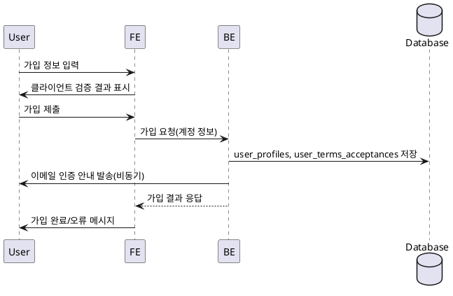

# Use Case 001: 회원가입 & 역할선택

- **Primary Actor**: 신규 사용자
- **Precondition**: 사용자는 아직 로그인하지 않았으며, 인증 가능한 이메일과 휴대폰 정보를 보유한다.
- **Trigger**: 사용자가 회원가입 페이지에서 역할을 선택하고 필수 정보를 입력한 뒤 가입을 시도한다.
- **Main Scenario**:
  1. 사용자가 이름, 휴대폰번호, 이메일, 약관동의, 역할, 인증 방식을 입력한다.
  2. FE는 필수 입력 여부와 형식을 검증한다.
  3. 검증이 완료되면 FE는 가입 요청을 BE로 전송한다.
  4. BE는 Supabase Auth 계정을 생성하고, `user_profiles`에 기본 정보를 기록한다.
  5. BE는 동의한 약관을 `user_terms_acceptances`에 보관하고, 역할을 저장한다.
  6. BE는 이메일 검증 절차를 시작하고 성공/실패 상태를 FE에 반환한다.
  7. FE는 사용자에게 가입 완료 및 인증 안내 메시지를 표시한다.
- **Edge Cases**:
  - 동일 이메일이 이미 사용 중이면 가입을 차단하고 중복 안내를 제공한다.
  - 약관 동의 누락 시 가입 요청을 거절한다.
  - 인증 메일 발송이 실패하면 재시도 옵션과 함께 오류 메시지를 제공한다.
  - 과도한 시도 발생 시 레이트 리밋 메시지를 표시한다.
- **Business Rules**:
  - 이메일은 계정당 유일해야 한다.
  - 약관에 필수 항목을 모두 동의해야 가입이 완료된다.
  - 역할과 인증 방식은 가입 시 반드시 선택해야 하며 이후 플로우 분기에 사용된다.
  - 레이트 리밋 정책에 따라 일정 시간 내 과도한 요청을 제한한다.

