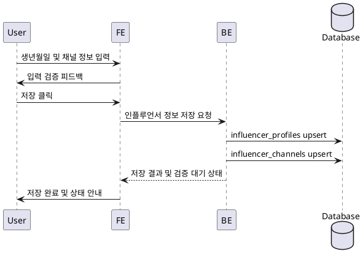

# Use Case 002: 인플루언서 정보 등록

- **Primary Actor**: 인플루언서 역할을 선택한 로그인 사용자
- **Precondition**: 사용자는 회원가입을 완료했고, 인플루언서 역할로 로그인해 있다.
- **Trigger**: 사용자가 인플루언서 정보 등록 화면에서 생년월일과 SNS 채널 정보를 입력해 저장을 시도한다.
- **Main Scenario**:
  1. 사용자가 생년월일을 입력하고 SNS 채널 유형·채널명·URL을 추가한다.
  2. FE는 날짜와 URL 형식을 검증한 뒤 저장 요청을 BE로 전송한다.
  3. BE는 `influencer_profiles`에 생년월일과 검증 상태를 저장하거나 갱신한다.
  4. BE는 채널별로 `influencer_channels` 레코드를 생성 또는 업데이트하고 검증 상태를 `pending`으로 설정한다.
  5. BE는 채널 검증을 비동기로 예약하고 결과 상태를 FE에 반환한다.
  6. FE는 저장 성공 메시지와 채널 검증 상태(대기 중)를 사용자에게 표시한다.
- **Edge Cases**:
  - 생년월일이 정책 기준을 충족하지 않으면 저장을 거절하고 이유를 안내한다.
  - 허용되지 않은 채널 유형이나 잘못된 URL은 FE 또는 BE에서 검증 실패 메시지로 안내한다.
  - 동일 채널 URL을 중복 등록하려 할 경우 중복 메시지를 반환한다.
- **Business Rules**:
  - 인플루언서 역할 사용자만 정보 등록 화면에 접근할 수 있다.
  - 허용된 채널 유형은 Naver, YouTube, Instagram, Threads로 제한된다.
  - 채널 검증이 완료되기 전까지 상태는 `pending`으로 유지된다.
  - 생년월일은 필수이며 정책상 허용된 연령 이상이어야 한다.

