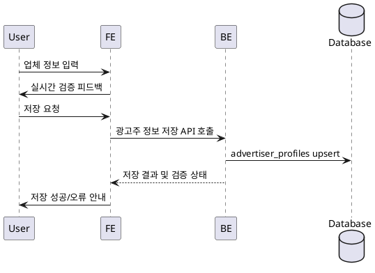

# Use Case 003: 광고주 정보 등록

- **Primary Actor**: 광고주 역할을 선택한 로그인 사용자
- **Precondition**: 사용자는 회원가입을 완료했고, 광고주 역할로 로그인해 있다.
- **Trigger**: 사용자가 광고주 정보 등록 화면에서 업체 정보를 입력해 저장을 요청한다.
- **Main Scenario**:
  1. 사용자가 업체명, 위치, 카테고리, 사업자등록번호를 입력한다.
  2. FE가 필수 항목과 형식을 검증한 후 저장 요청을 BE에 전달한다.
  3. BE는 `advertiser_profiles`에 입력값을 저장하거나 갱신한다.
  4. BE는 사업자등록번호 중복 여부를 확인하고 검증 상태를 `pending`으로 설정한다.
  5. BE는 외부 검증 절차를 위한 잡을 예약하고 저장 결과를 FE에 반환한다.
  6. FE는 저장 성공 메시지와 검증 진행 상태(대기)를 사용자에게 출력한다.
- **Edge Cases**:
  - 사업자등록번호가 중복되면 저장을 거절하고 중복 안내를 제공한다.
  - 필수 필드가 누락되면 즉시 검증 오류를 표시한다.
  - 외부 검증 예약에 실패하면 재시도 안내와 함께 오류를 반환한다.
- **Business Rules**:
  - 광고주 역할 사용자만 등록 화면을 사용할 수 있다.
  - 사업자등록번호는 시스템 내에서 유일해야 한다.
  - 검증 상태가 `verified`로 확정되기 전에는 체험단 생성 권한을 제한할 수 있다.
  - 모든 필드는 텍스트 기반이며 빈 값은 허용되지 않는다.

