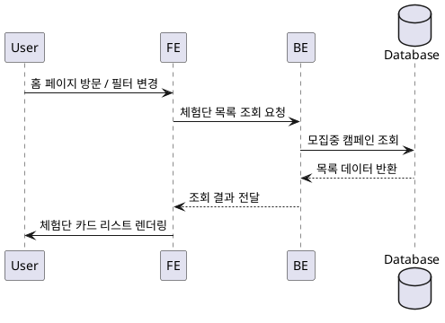

# Use Case 004: 홈 & 체험단 목록 탐색

- **Primary Actor**: 로그인 여부와 관계없이 체험단을 찾는 사용자
- **Precondition**: 사용자는 홈 화면에 접근할 수 있고, 기본 네트워크 연결이 가능하다.
- **Trigger**: 사용자가 홈 페이지에 진입하거나 필터/정렬 옵션을 선택한다.
- **Main Scenario**:
  1. 사용자가 홈 화면을 요청한다.
  2. FE는 기본 정렬(최신순)과 선택된 필터를 포함해 목록 조회 API를 호출한다.
  3. BE는 `campaigns`에서 `status = 'recruiting'` 조건으로 체험단을 조회하고 페이징을 적용한다.
  4. BE는 조회 결과를 FE로 반환한다.
  5. FE는 배너와 함께 체험단 카드 리스트를 렌더링하고 사용자에게 표시한다.
- **Edge Cases**:
  - 모집 중 체험단이 없을 경우 빈 상태 메시지를 보여준다.
  - 잘못된 필터 값이 전달되면 기본값으로 대체하거나 오류 메시지를 반환한다.
  - 데이터 조회 실패 시 재시도 옵션과 함께 오류 알림을 제공한다.
- **Business Rules**:
  - 목록에는 모집 중인 체험단만 노출된다.
  - 기본 정렬은 최신 등록 순이며, 사용자가 변경할 수 있다.
  - 페이징 파라미터는 시스템에서 허용된 범위를 넘지 않아야 한다.

