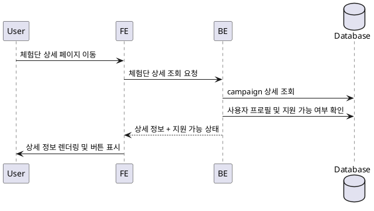

# Use Case 005: 체험단 상세

- **Primary Actor**: 체험단 세부 내용을 확인하려는 사용자
- **Precondition**: 사용자는 체험단 목록에서 상세 페이지로 이동할 수 있고, 인플루언서일 경우 프로필 완성 여부가 존재한다.
- **Trigger**: 사용자가 특정 체험단 카드를 클릭해 상세 페이지에 접근한다.
- **Main Scenario**:
  1. 사용자가 체험단 상세 페이지를 요청한다.
  2. FE는 선택된 체험단 ID로 상세 조회 API를 호출한다.
  3. BE는 `campaigns`에서 모집 정보, 혜택, 미션, 매장정보, 모집인원을 조회한다.
  4. BE는 추가로 사용자 역할과 인플루언서 프로필 완료 여부를 확인해 지원 가능 상태를 계산한다.
  5. BE는 상세 정보와 지원 버튼 노출 여부를 FE로 반환한다.
  6. FE는 상세 정보를 렌더링하고, 지원 조건을 충족하는 경우 “지원하기” 버튼을 표시한다.
- **Edge Cases**:
  - 모집 기간이 종료된 경우 지원 버튼을 숨기고 종료 안내를 제공한다.
  - 인플루언서 정보가 미완성인 경우 가드 메시지를 표시한다.
  - 조회 대상 체험단이 존재하지 않으면 404 메시지를 노출한다.
- **Business Rules**:
  - 지원 버튼은 로그인한 인플루언서이며 프로필이 완성된 경우에만 노출된다.
  - 모집 상태가 `closed` 또는 `selected`이면 지원 불가 상태로 처리한다.
  - 상세 페이지는 체험단의 모든 필수 정보를 표시해야 한다.

