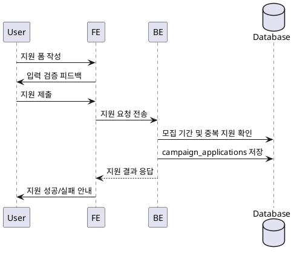

# Use Case 006: 체험단 지원

- **Primary Actor**: 지원하려는 인플루언서
- **Precondition**: 사용자는 인플루언서 역할로 로그인했고, 인플루언서 정보 등록을 완료했다.
- **Trigger**: 체험단 상세 페이지에서 “지원하기” 버튼을 눌러 지원 폼을 제출한다.
- **Main Scenario**:
  1. 사용자가 각오 한마디와 방문 예정일을 입력하고 제출한다.
  2. FE는 필수 값과 날짜 형식을 검증한다.
  3. 검증이 완료되면 FE는 지원 요청을 BE로 보낸다.
  4. BE는 모집 기간과 중복 지원 여부를 확인한다.
  5. 검사가 통과되면 `campaign_applications`에 지원 정보를 `status = 'applied'`로 저장한다.
  6. BE는 저장 결과를 FE에 반환한다.
  7. FE는 제출 완료 메시지를 보여주고 “내 지원 목록” 갱신을 안내한다.
- **Edge Cases**:
  - 모집 기간이 지났으면 지원을 거절하고 상태 메시지를 제공한다.
  - 동일 체험단에 이미 지원한 경우 중복 지원 오류를 표시한다.
  - 방문 예정일이 과거일 경우 FE에서 입력 오류를 안내한다.
- **Business Rules**:
  - 동일 인플루언서는 체험단마다 한 번만 지원할 수 있다.
  - 지원은 모집 기간 내에만 허용된다.
  - 제출 데이터(각오, 방문 예정일)는 비어 있을 수 없다.

