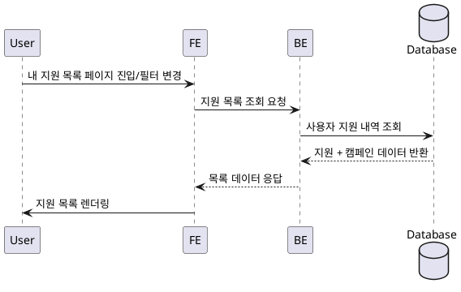

# Use Case 007: 내 지원 목록 (인플루언서 전용)

- **Primary Actor**: 체험단에 지원한 인플루언서
- **Precondition**: 사용자는 인플루언서 역할로 로그인했고, 하나 이상의 체험단에 지원했거나 목록을 조회할 권한이 있다.
- **Trigger**: 사용자가 메뉴에서 “내 지원 목록”을 선택하거나 상태 필터를 변경한다.
- **Main Scenario**:
  1. 사용자가 내 지원 목록 페이지에 접근하거나 필터를 조정한다.
  2. FE는 선택된 상태 필터를 포함해 지원 목록 조회 API를 호출한다.
  3. BE는 `campaign_applications`에서 현재 사용자 ID와 상태 조건에 맞는 레코드를 조회한다.
  4. BE는 관련 체험단의 기본 정보를 합쳐 결과를 FE에 반환한다.
  5. FE는 지원 상태(신청완료/선정/반려)에 따라 목록을 렌더링한다.
- **Edge Cases**:
  - 조회 결과가 없으면 빈 상태 안내를 노출한다.
  - 지원자가 아닌 사용자가 접근하면 권한 오류를 반환한다.
  - 지원 상태 필터 값이 허용 범위를 벗어나면 기본값으로 대체한다.
- **Business Rules**:
  - 사용자는 자신의 지원 내역만 조회할 수 있다.
  - 기본 필터는 모든 상태이며, 필요 시 특정 상태만 선택할 수 있다.
  - 각 항목은 최신 제출 순으로 정렬한다.

