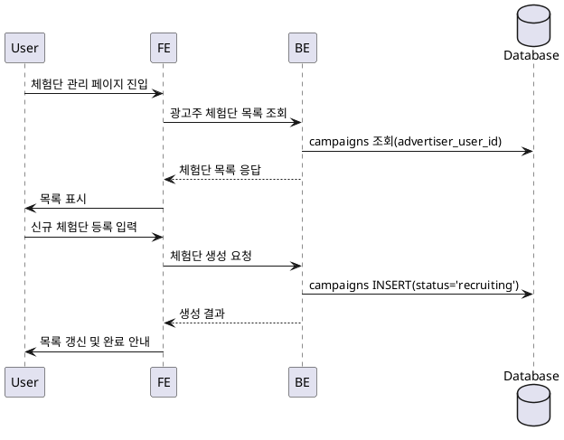

# Use Case 008: 광고주 체험단 관리

- **Primary Actor**: 체험단을 운영하는 광고주
- **Precondition**: 사용자는 광고주 역할로 로그인했고, 광고주 정보 등록을 완료했다.
- **Trigger**: 사용자가 “체험단 관리” 페이지에 접속하거나 신규 체험단 등록 버튼을 클릭한다.
- **Main Scenario**:
  1. 사용자가 체험단 관리 페이지를 연다.
  2. FE는 광고주가 등록한 체험단 목록을 조회하기 위해 API를 호출한다.
  3. BE는 `campaigns`에서 현재 광고주가 소유한 체험단을 조회해 반환한다.
  4. 사용자가 신규 체험단 등록을 선택하면 FE가 다이얼로그를 열고 입력을 받는다.
  5. FE는 입력값을 검증한 뒤 BE에 신규 체험단 생성 요청을 보낸다.
  6. BE는 `campaigns`에 체험단을 `status = 'recruiting'`으로 저장하고 결과를 FE에 전달한다.
  7. FE는 목록을 갱신해 신규 체험단을 표시한다.
- **Edge Cases**:
  - 광고주 정보 검증이 완료되지 않았다면 체험단 생성을 제한하고 안내 메시지를 표시한다.
  - 필수 입력이 누락되면 등록 요청을 거절한다.
  - 목록 조회나 생성 중 오류가 발생하면 재시도 안내를 제공한다.
- **Business Rules**:
  - 광고주는 자신이 등록한 체험단만 조회할 수 있다.
  - 신규 체험단은 기본 상태가 `recruiting`이어야 한다.
  - 모집 인원은 1 이상이어야 하며, 모집 기간은 시작일 ≤ 종료일을 만족해야 한다.

