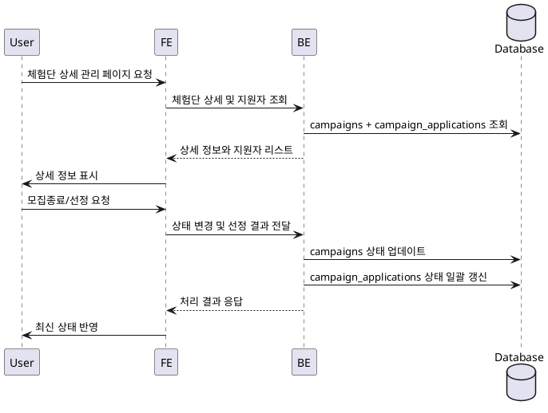

# Use Case 009: 광고주 체험단 상세 & 모집 관리

- **Primary Actor**: 모집 상태를 관리하는 광고주
- **Precondition**: 사용자는 광고주 역할로 로그인했고, 관리하려는 체험단의 소유자다.
- **Trigger**: 광고주가 체험단 상세 페이지에 접근해 모집 종료 또는 선정 절차를 진행한다.
- **Main Scenario**:
  1. 사용자가 관리 대상 체험단 상세 페이지를 연다.
  2. FE는 체험단 상세 정보와 지원자 리스트를 조회하는 API를 호출한다.
  3. BE는 `campaigns`와 `campaign_applications`에서 데이터를 조회해 FE로 전달한다.
  4. 광고주가 “모집종료”를 선택하면 FE가 상태 변경 요청을 전송하고, BE는 체험단 상태를 `closed`로 업데이트한다.
  5. 광고주가 “체험단 선정”을 선택하고 인원을 확정하면 FE가 선택 목록을 BE에 전송한다.
  6. BE는 선택된 지원자를 기준으로 `campaign_applications` 상태를 `selected`/`rejected`로 일괄 갱신하고, 체험단 상태를 `selected`로 업데이트한다.
  7. BE는 결과를 FE에 반환하고, FE는 최신 상태를 사용자에게 표시한다.
- **Edge Cases**:
  - 모집 상태가 이미 `closed` 이상이면 중복 상태 변경을 막고 안내한다.
  - 선정 인원이 모집 정원을 초과하면 저장을 거절한다.
  - 지원자가 없는 상태에서 선정 절차를 시도하면 오류 메시지를 반환한다.
- **Business Rules**:
  - 상태 전환은 `recruiting` → `closed` → `selected` 순서를 따라야 한다.
  - 선정된 인플루언서 수는 체험단 모집 인원 이하여야 한다.
  - 상태 변경 시 관련 지원자의 상태를 일관되게 갱신해야 한다.

